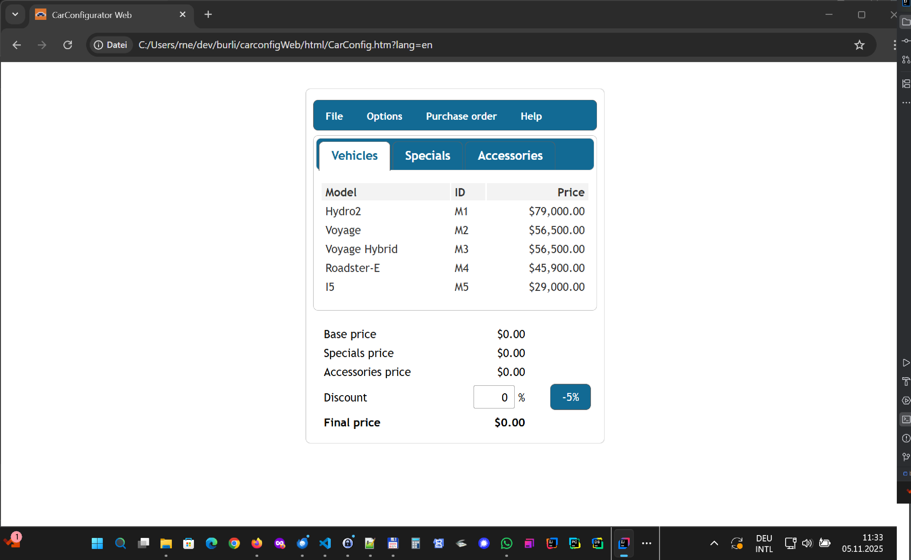
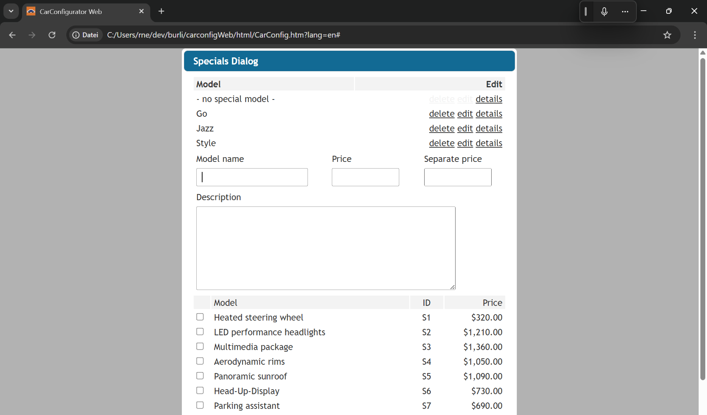
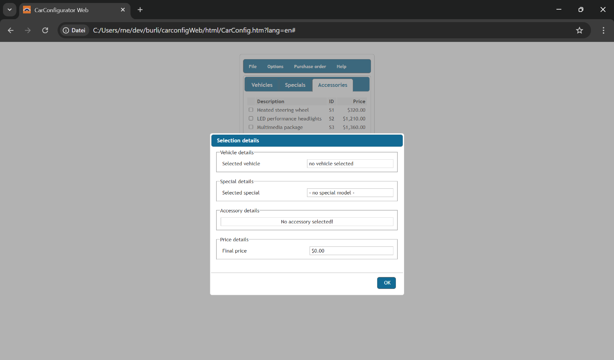
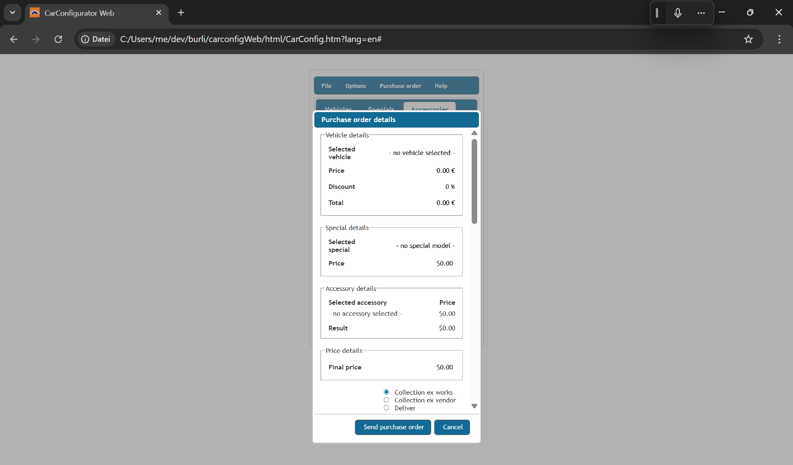

:doctype: book
:toc:

= App

== Car Configurator

[,java]
----
include::CarConfig_.scala[tag=fields]
----

== Vehicles

[,java]
----
include::vehicles/Vehicles_.scala[tag=fields]
----

=== Vehicles Dialog

image::VehiclesDialog.png[]

[,java]
----
include::vehicles/VehiclesDialog_.scala[tag=fields]
----

== Specials

image::Specials.png[]

[,java]
----
include::specials/Specials_.scala[tag=fields]
----

=== Specials Dialog

[,java]
----
include::specials/SpecialsDialog_.scala[tag=fields]
----

== Accessories

image::Accessories.png[]

[,java]
----
include::accessories/Accessories_.scala[tag=fields]
----

=== Accessories Dialog

image::AccessoriesDialog.png[]

[,java]
----
include::accessories/AccessoriesDialog_.scala[tag=fields]
----

== Selection details

== Purchase order details

