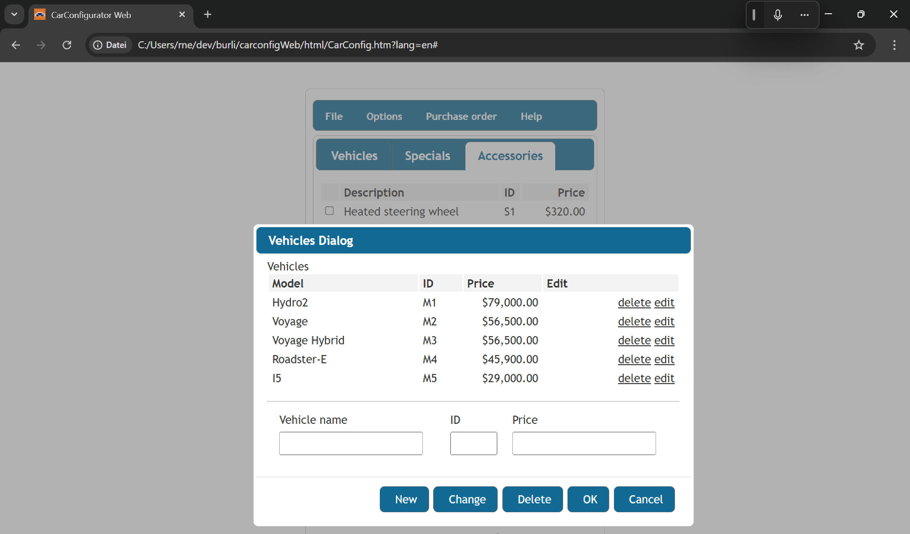
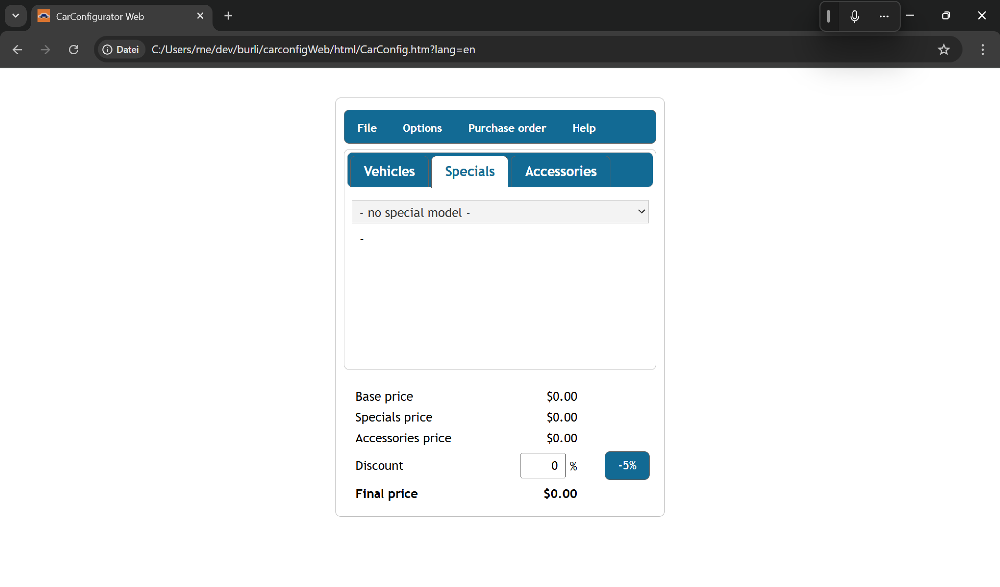
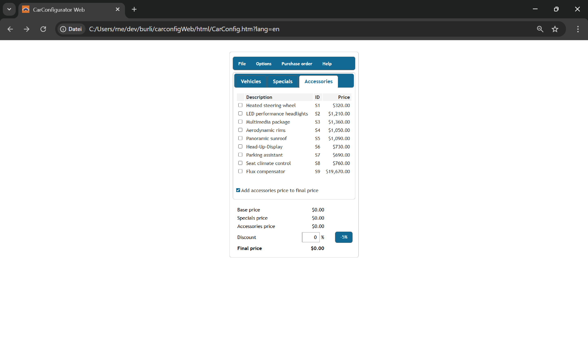
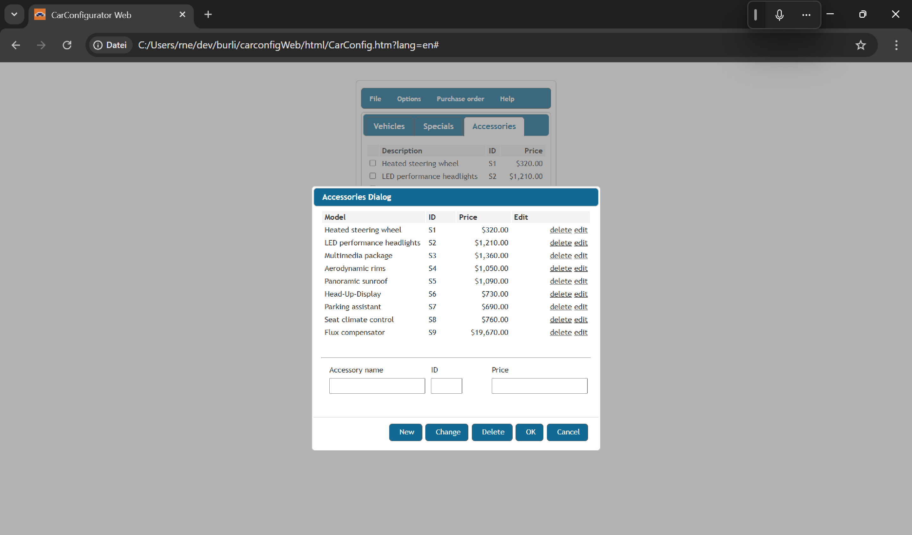

:doctype: book
:toc:

:UI: ../ui/
= App

== Car Configurator

image::Vehicles.png[]

[,java]
----
include::{UI}CarConfig_.scala[tag=fields]
----

== Vehicles

image::Vehicles.png[]

[,java]
----
include::{UI}vehicles/Vehicles.scala[tag=fields]
----

=== Vehicles Dialog

[,java]
----
include::{UI}vehicles/VehiclesDialog.scala[tag=fields]
----

== Specials

[,java]
----
include::{UI}specials/Specials.scala[tag=fields]
----

=== Specials Dialog

image::SpecialsDialog.png[]

[,java]
----
include::{UI}specials/SpecialsDialog.scala[tag=fields]
----

== Accessories

[,java]
----
include::{UI}accessories/Accessories.scala[tag=fields]
----

=== Accessories Dialog

[,java]
----
include::{UI}accessories/AccessoriesDialog.scala[tag=fields]
----

== Selection details

image::SelectionDetails.png[]

== Purchase order details

image::PurchaseOrderDetails.png[]

[,java]
----
include::{UI}PurchaseOrderDetails_.scala[tag=fields]
----
